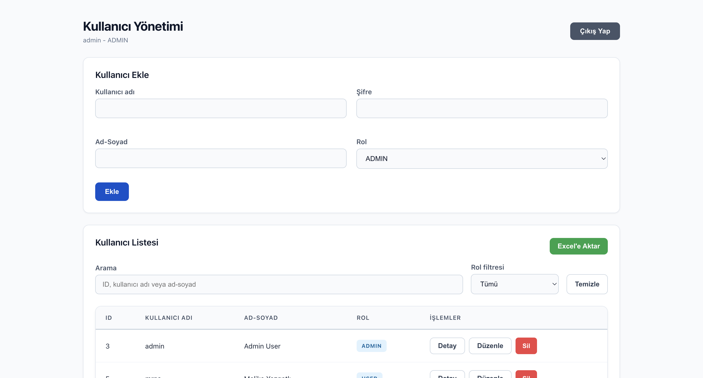
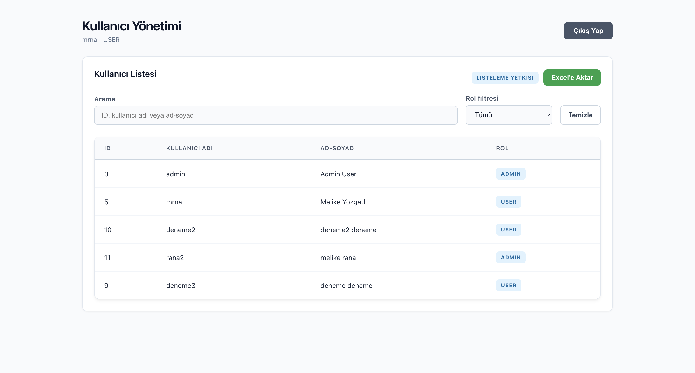

# Kullanıcı Yönetim Sistemi

Bu proje, JWT authentication kullanan bir kullanıcı yönetim uygulamasıdır. Backend tarafında NestJS ile REST API, frontend tarafında Angular, veritabanı olarak PostgreSQL kullanılmıştır.

## Teknolojiler

- Backend: Node.js, NestJS
- Frontend: Angular
- Veritabanı: PostgreSQL
- Authentication: JWT
- Şifreleme: bcrypt

## Proje Yapısı

```text
Renault/
  user-management-api/   NestJS REST API
  user-management-ui/    Angular frontend uygulaması
```

## Özellikler

- Kullanıcı adı ve şifre ile giriş
- JWT token ile yetkilendirme
- Kullanıcı listesini görüntüleme
- Kullanıcı detayını görüntüleme
- Kullanıcı ekleme
- Kullanıcı güncelleme
- Kullanıcı silme
- Role göre yetkilendirme
- Üst bildirim sistemi
- Kullanıcı listesini Excel formatında dışa aktarma

## Demo Video

[YouTube Demo Videosu](https://youtu.be/h2CiBUruURM)

## Ekran Görüntüleri

### Admin Ekranı



### Standart Kullanıcı Ekranı



## Roller

### ADMIN

Admin kullanıcı aşağıdaki işlemleri yapabilir:

- Kullanıcı listesini görüntüleme
- Kullanıcı detayını görüntüleme
- Kullanıcı ekleme
- Kullanıcı güncelleme
- Kullanıcı silme
- Kullanıcı listesini Excel olarak indirme

### USER

Standart kullanıcı aşağıdaki işlemleri yapabilir:

- Kullanıcı listesini görüntüleme
- Kullanıcı listesini Excel olarak indirme

## Backend Kurulumu

Backend dizinine gidin:

```bash
cd user-management-api
```

Bağımlılıkları yükleyin:

```bash
npm install
```

Uygulamayı başlatın:

```bash
npm run start
```

Backend varsayılan olarak şu adreste çalışır:

```text
http://localhost:3000
```

## Frontend Kurulumu

Frontend dizinine gidin:

```bash
cd user-management-ui
```

Bağımlılıkları yükleyin:

```bash
npm install
```

Uygulamayı başlatın:

```bash
npm run start
```

Frontend varsayılan olarak şu adreste çalışır:

```text
http://localhost:4200
```

## Veritabanı Ayarları

Backend uygulaması PostgreSQL'e aşağıdaki bilgilerle bağlanacak şekilde ayarlanmıştır:

```text
host: localhost
port: 5432
user: postgres
password: 2005
database: user_management
```

Veritabanında `users` tablosu bulunmalıdır. Örnek tablo yapısı:

```sql
CREATE TABLE users (
  id SERIAL PRIMARY KEY,
  username VARCHAR(100) NOT NULL UNIQUE,
  password VARCHAR(255) NOT NULL,
  full_name VARCHAR(150) NOT NULL,
  role VARCHAR(20) NOT NULL
);
```

Örnek admin kullanıcı eklemek için şifrenin bcrypt ile hashlenmiş olması önerilir. Geliştirme amaçlı mevcut login yapısı eski plain text şifreleri de kontrol edebilir.

```sql
INSERT INTO users (username, password, full_name, role)
VALUES ('admin', '123456', 'Admin User', 'ADMIN');
```

## API Endpointleri

### Auth

```text
POST /auth/login
```

Request body:

```json
{
  "username": "admin",
  "password": "123456"
}
```

Response:

```json
{
  "access_token": "jwt_token",
  "user": {
    "id": 1,
    "username": "admin",
    "full_name": "Admin User",
    "role": "ADMIN"
  }
}
```

### Users

Tüm `/users` endpointleri JWT token ile korunur.

```text
GET /users
GET /users/:id
POST /users
PUT /users/:id
DELETE /users/:id
```

Admin yetkisi gerektiren endpointler:

```text
GET /users/:id
POST /users
PUT /users/:id
DELETE /users/:id
```

Authorization header:

```text
Authorization: Bearer jwt_token
```

## Frontend Kullanım Akışı

1. Kullanıcı login ekranından kullanıcı adı ve şifre ile giriş yapar.
2. Başarılı giriş sonrası JWT token tarayıcının localStorage alanında saklanır.
3. Kullanıcı `/users` ekranına yönlendirilir.
4. Admin kullanıcı ekleme, güncelleme, silme ve detay görüntüleme işlemlerini yapabilir.
5. Standart kullanıcı sadece kullanıcı listesini görüntüler.
6. Excel'e Aktar butonu ile ekrandaki filtrelenmiş liste indirilebilir.

## Build Komutları

Backend build:

```bash
cd user-management-api
npm run build
```

Frontend build:

```bash
cd user-management-ui
npm run build
```

## Notlar

- Backend `3000`, frontend `4200` portunu kullanır.
- Bu portlar doluysa uygulama başlamaz. İlgili portu kullanan process kapatılmalı veya farklı port tercih edilmelidir.
- JWT secret ve veritabanı bilgileri geliştirme ortamında kod içinde tanımlıdır. Gerçek ortamda `.env` dosyası ile yönetilmesi önerilir.
- Excel export işlemi frontend tarafında, ekrandaki filtrelenmiş kullanıcı listesi üzerinden yapılır.
- Projeyi çalıştırmadan önce user-management-api/src/db/db.module.ts içindeki PostgreSQL bağlantı bilgileri kendi local PostgreSQL ayarlarınıza göre güncellenmelidir.
